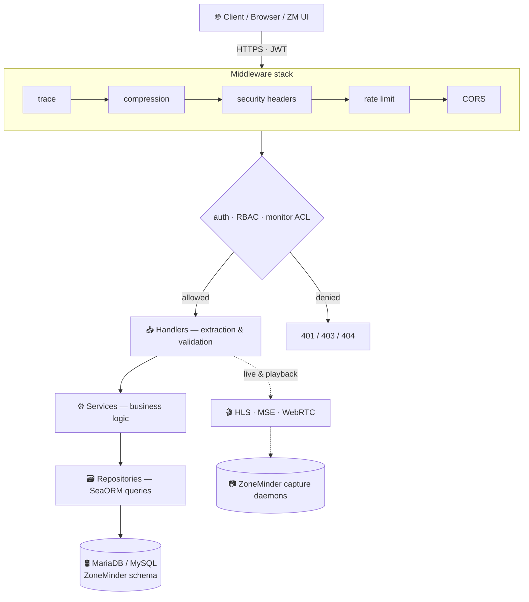

<div align="center">

# 🎥 zm_api

### A modern, fast, type-safe REST API for [ZoneMinder](https://zoneminder.com)

*Rebuilding ZoneMinder's aging Perl/PHP API surface as a single, well-tested Rust service —
with live streaming, fine-grained access control, and OpenAPI docs baked in.*

[](https://github.com/SteveGilvarry/zm-api/actions/workflows/test.yml)


</div>

---

## ✨ Why zm_api?

ZoneMinder is a rock-solid surveillance platform, but its API grew organically across Perl,
PHP, and CGI over two decades. **zm_api** replaces that surface with one cohesive service:

- 🦀 **One binary, one language** — no PHP-FPM, no CGI, no Perl runtime to babysit.
- ⚡ **Fast & async** — built on Axum + Tokio; streaming endpoints don't block the API.
- 🔒 **Secure by default** — JWT auth, per-feature RBAC, *and* row-level monitor ACLs.
- 📖 **Self-documenting** — every endpoint is in an auto-generated OpenAPI spec + Swagger UI.
- 🧪 **Actually tested** — ~600 unit + integration tests, with a coverage gate in CI.
- 🗄️ **Drop-in schema** — talks directly to an existing ZoneMinder MySQL/MariaDB database.

---

## 🚀 Features

### 📹 Monitors & Events
Full CRUD for monitors, events, frames, zones, and event metadata — paginated, filterable,
and searchable. Monitor state & alarm control. Per-monitor snapshots straight from the live
stream.

### 🎬 Live Streaming
Three delivery paths from one API:
- **HLS** — fragmented-MP4 playlists for any HTML5 `<video>` element.
- **MSE** — low-latency fMP4 pushed over a WebSocket.
- **WebRTC** — native peer connection with ICE/SDP signaling.

Plus recorded-event playback (video, byte-range seeking, thumbnails).

### 🕹️ PTZ Control
Pan/tilt/zoom with native protocol drivers and a Perl-bridge fallback — ONVIF and
vendor protocols, presets, and continuous control.

### 🔐 Access Control
- **JWT** access + refresh tokens.
- **Feature RBAC** — ZoneMinder's 8 permission columns (`Stream`, `Events`, `Control`,
  `Monitors`, `Groups`, `Devices`, `Snapshots`, `System`) enforced on every route.
- **Row-level ACLs** — `Monitors_Permissions` / `Groups_Permissions` resolved per request,
  so a user only ever sees the monitors they're granted (default-allow, fully backward
  compatible).

### 🛠️ Operations
Daemon supervision (zmc/zma) with a Unix-socket IPC shim for legacy `zmdc.pl` compatibility,
storage & server management, configs, logs, montage layouts, and system control —
all behind graceful SIGTERM/SIGINT shutdown.

### 🧱 Production hardening
TLS with optional ACME/Let's Encrypt, security headers, gzip/brotli compression
(streaming routes excluded), request-body limits, and opt-in per-IP rate limiting.

---

## 🏗️ Architecture

A clean, one-way layered flow — handlers never touch the database directly.



| Layer | Path | Responsibility |
|------|------|----------------|
| **Routes** | `src/routes/` | Endpoint wiring & middleware layering |
| **Handlers** | `src/handlers/` | Request extraction, validation, response mapping |
| **Services** | `src/service/` | Business logic |
| **Repositories** | `src/repo/` | Database queries |
| **Entities** | `src/entity/` | SeaORM models (generated from the ZM schema) |
| **DTOs** | `src/dto/` | Request/response types (OpenAPI schemas) |

---

## 🧰 Tech Stack

| | |
|---|---|
| **Language** | Rust (edition 2021) |
| **Web framework** | [Axum](https://github.com/tokio-rs/axum) 0.8 |
| **Async runtime** | [Tokio](https://tokio.rs) |
| **ORM** | [SeaORM](https://www.sea-ql.org/SeaORM/) 1.1 (MySQL/MariaDB) |
| **API docs** | [utoipa](https://github.com/juhaku/utoipa) + Swagger UI |
| **Auth** | JSON Web Tokens (`jsonwebtoken`) |
| **Streaming** | `webrtc`, fMP4/MSE, HLS, `retina` (RTSP) |
| **Media** | FFmpeg (`ffmpeg-next`) for H.264 → JPEG |

---

## 🚀 Quick Start

### Prerequisites

- **Rust** (current stable) — install via [rustup](https://rustup.rs)
- **MariaDB / MySQL** with a ZoneMinder schema
- **FFmpeg dev libraries** — `libavutil-dev libavcodec-dev libavformat-dev libavfilter-dev
  libavdevice-dev libswscale-dev libswresample-dev` (Debian/Ubuntu) or `brew install ffmpeg`

### Run it

```bash
# 1. Clone
git clone https://github.com/SteveGilvarry/zm-api.git
cd zm-api

# 2. Spin up a local test database (Docker / Apple Container)
./scripts/db-manager.sh start
./scripts/db-manager.sh mysql      # load the ZoneMinder schema

# 3. Build & run
cargo run                          # uses settings/base.toml
APP_PROFILE=prod cargo run         # production profile
```

The API comes up on the address/port from your active profile (see `settings/`).

### Explore the API

Once running, open the interactive docs:

| | |
|---|---|
| 🧭 **Swagger UI** | `http://<host>:<port>/swagger-ui` |
| 📄 **OpenAPI spec** | `http://<host>:<port>/api-docs/openapi.json` |

---

## ⚙️ Configuration

Settings are layered, last one wins:

1. `settings/base.toml` — defaults
2. `settings/{APP_PROFILE}.toml` — `dev` · `test` · `test-db` · `prod`
3. **Environment variables** — prefix `APP_`, nested keys use `__`

```bash
APP_PROFILE=prod
APP_DB__HOST=10.0.0.5            # overrides db.host
APP_CONFIG_DIR=/etc/zm_api       # alternate config directory
```

> 💡 Local profiles like `settings/dev.toml` are gitignored — keep secrets out of version control.

---

## 🧪 Testing

```bash
# Unit + non-DB tests
cargo test --all-features

# Full integration suite (needs the test database)
./scripts/db-manager.sh start && ./scripts/db-manager.sh mysql
APP_PROFILE=test-db cargo test --test '*' -- --include-ignored

# Coverage report
cargo llvm-cov --all-features --ignore-filename-regex '/(entity|migration)/' \
  -- --include-ignored
```

CI runs the suite on every push and **gates line coverage** — it can't regress below the
floor. Currently **~59%** and climbing, ~600 tests across unit + per-domain integration files.

---

## 📁 Project Layout

```
src/
├── routes/      Axum routers & middleware wiring
├── handlers/    HTTP handlers
├── service/     Business logic
├── repo/        Database query layer
├── entity/      SeaORM entities (generated from the ZM schema)
├── dto/         Request/response DTOs
├── streaming/   HLS / MSE / WebRTC pipelines
├── ptz/         PTZ control drivers
├── daemon/      ZoneMinder daemon supervision
├── configure/   Config loading
└── error/       AppError + HTTP mapping
scripts/         DB management, JWT key generation, CI helpers
settings/        Layered TOML configuration
docs/            Deployment, TLS, PTZ & streaming design notes
```

---

## 🤝 Contributing

Before opening a PR, make sure the local quality gates pass:

```bash
cargo fmt --all -- --check
cargo clippy --all-targets --all-features -- -D warnings
cargo test --all-features
```

Work tests-first, keep changes focused, and treat `src/entity/` as generated artifacts.
See [`CLAUDE.md`](CLAUDE.md) for the full development workflow and conventions.

---

## 📄 License

zm_api is **dual-licensed**:

- 🆓 **Open source — [AGPL-3.0](LICENSE).** Free to use, modify, and self-host. If you
  run a modified version as a network service, the AGPL requires you to publish your
  changes.
- 💼 **Commercial license.** For embedding zm_api in a closed-source product, or running a
  modified version as a hosted service without the AGPL's source-sharing obligation, a
  commercial license is available. Contact the maintainer to enquire.

Contributions are accepted under a [Contributor License Agreement](CLA.md) so the project
can be offered under both licenses — see [`CONTRIBUTING.md`](CONTRIBUTING.md).

> The `db/*.sql` schema files are from ZoneMinder and remain under its GPL-2.0 license.

---

<div align="center">
<sub>Built with 🦀 for the ZoneMinder community.</sub>
</div>
